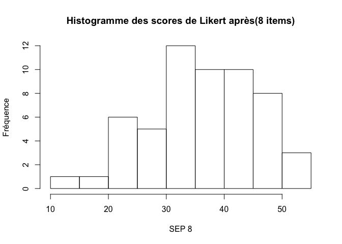
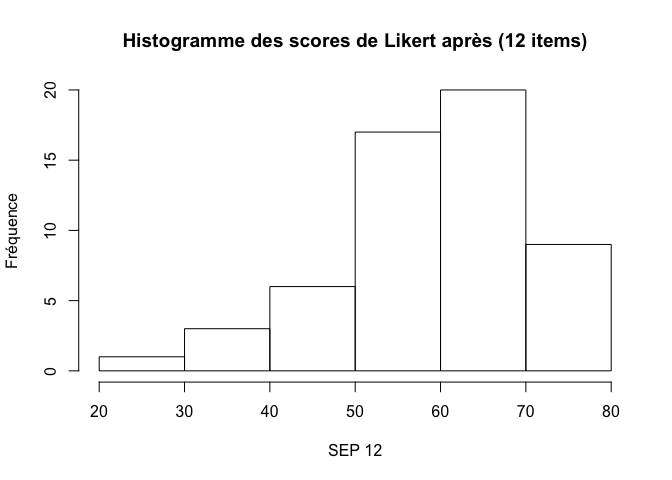

# Mémoire d'Anne Weiss: SEP et pré-briefing
jcb  
24 juin 2015  


Lecture des fichiers
====================


Fichier des apprenants:

```
 [1] "ID_Etud"                      "Groupe_ID"                   
 [3] "SMI"                          "FDP"                         
 [5] "FMN"                          "PROF"                        
 [7] "ETUDE"                        "SEXE"                        
 [9] "ROLE"                         "Nature.de.la.formation..NAT."
[11] "PREB"                        
```

Questionnaire "avant" (lk.av):

```
 [1] "DATE"      "ID_Etud"   "Groupe_ID" "Q1.av"     "Q2.av"    
 [6] "Q3.av"     "Q4.av"     "Q5.av"     "Q6.av"     "Q7.av"    
[11] "Q8.av"     "Q9.av"     "Q10.av"    "Q11.av"    "Q12.av"   
```
Questionnaire après (lk.ap):

```
 [1] "DATE"      "ID_Etud"   "Groupe_ID" "Q1.ap"     "Q2.ap"    
 [6] "Q3.ap"     "Q4.ap"     "Q5.ap"     "Q6.ap"     "Q7.ap"    
[11] "Q8.ap"     "Q9.ap"     "Q10.ap"    "Q11.ap"    "Q12.ap"   
```
Les items de Likert correspondent aux colonnes 4 à 15

On forme un fichier global par combinaison des questionnaires _avant_ et _après_. Ajout d'une colonne __PREB__ (O/N) pour identifier le groupe ayant bénéficié d'un prébriefing.

```
 [1] "DATE"      "ID_Etud"   "Groupe_ID" "Q1.av"     "Q2.av"    
 [6] "Q3.av"     "Q4.av"     "Q5.av"     "Q6.av"     "Q7.av"    
[11] "Q8.av"     "Q9.av"     "Q10.av"    "Q11.av"    "Q12.av"   
[16] "Q1.ap"     "Q2.ap"     "Q3.ap"     "Q4.ap"     "Q5.ap"    
[21] "Q6.ap"     "Q7.ap"     "Q8.ap"     "Q9.ap"     "PREB"     
```

Analyse des groupes avec et sans prebriefing
============================================

Toutes les caractéristiques des groupes sont de nature qualitative. Le test approprié pour les comparer est le test du Chi2 (avec correction de continuité de Yates). Cependant les effectifs sont faibles et lorsque les conditions d'application du chi2 ne sont pas respectées, des effectifs ont été regroupés (années d'étude) et/ou le test exact de Fisher a été utilisé. Les goupes sont considérés comme différents si _p-value_ est plus petite que 0.05.

Sexe sdes apprenants
---------------------

```
    PREB
Sexe  N  O
   F 17 17
   M 12 10
```
La répartition des hommes et des femmes est identique dans deux groupes (p = 0.953
)

SMI (situation de mort inattendue)
----------------------------------

```
                            PREB
SMI                           N  O
  jamais                      4  5
  plusieurs fois par an      22 18
  plusieurs fois par mois     3  2
  plusieurs fois par semaine  0  2
```
Pas de différence entre les deux groupes (p = 0.557)

FDP formation décès patient
---------------------------

```
   PREB
FDP  N  O
  N 16 20
  O 13  7
```
Pas de différence entre les deux groupes (p = 0.232)

FMN formation annonce mauvaise nouvelle
---------------------------------------

```
   PREB
FMN  N  O
  N  7 16
  O 22 11
```
__Différence significative__ entre les deux groupes (p = 0.016)

Profession
----------

```
          PREB
PROF        N  O
  DESC AN   4  1
  DESC MU   0  1
  ETUDIANT 25 25
```
Pas de différence entre les deux groupes (p = 0.557)

Rôle dans la simulation
-----------------------

```
             PREB
ROLE           N  O
  EXTERNE      6  6
  IDE          3  3
  INTERNE      4  4
  OBSERVATEUR 16 14
```
Pas de différence entre les deux groupes (p = 1)

Années d'étude
--------------


```
               PREB
Années d'études  N  O
              1  0  1
              3  0  1
              4  4  0
              6 25 18
              7  0  3
              8  0  3
```

```
                N  O
moins de 6 ans  4  2
6 ans ou plus  25 24
```
Pas de différence entre les deux groupes (p = 0.672)

__Conclusion: les groupes avec et sans prébriefing ne sont pas différents sauf en ce qui concerne la formation à l'annonce d'une mauvaise nouvelle.__

Analyse du sentiment d'efficacité personnel (SEP)
=================================================

Le SEP est mesuré sur les 8 premiers items du score de Likert (validé) et sur les 12 items (expérimental).

Pré-test
-----------------------

### SEP8
  

- moyenne SEP8: $30.4 \pm{8.4}$
- médiane SEP8: $30$

### SEP12
 

- moyenne SEP12: $53.7 \pm{9.301}}$
- médiane SEP12: $54$

Comparaison du SEP avant la formation, selon que les apprenants aient bénéficiés ou non d'un prébriefing (Test T de Student):


- SEP8: pas de différence (p = 0.412)
- SEP12: pas de différence (p = 0.517)


__Conclusion__: les groupes ne sont pas différents en ce qui concerne le sentiment d'efficacité personnel avant la formation.

Post-test
-----------------------

```
##    Min. 1st Qu.  Median    Mean 3rd Qu.    Max. 
##    11.0    31.0    36.0    36.7    44.0    55.0
```

```
## [1] 9.41
```

 

```
##    Min. 1st Qu.  Median    Mean 3rd Qu.    Max. 
##    27.0    53.0    61.0    59.6    69.0    78.0
```

```
## [1] 11.1
```

 

```
## 
## 	Welch Two Sample t-test
## 
## data:  SEP8 by PREB
## t = 0.883, df = 50.5, p-value = 0.3816
## alternative hypothesis: true difference in means is not equal to 0
## 95 percent confidence interval:
##  -2.86  7.34
## sample estimates:
## mean in group N mean in group O 
##            37.8            35.5
```

```
## 
## 	Welch Two Sample t-test
## 
## data:  SEP12 by PREB
## t = 0.989, df = 49.8, p-value = 0.3274
## alternative hypothesis: true difference in means is not equal to 0
## 95 percent confidence interval:
##  -3.05  8.98
## sample estimates:
## mean in group N mean in group O 
##              61              58
```

__Conclusion__: après la formation, le SEP à progressé mais dans les mêmes proportions dans les deux groupes et il n'y a pas de différence de entre les SEP que le groupe ait bénéficié ou pas d'un prébriefing. 

Est-ce que la formation a une influence sur le SEP?
----------------------------------------------------
Pour répondre à la question, on compare le SEP avant et après la formation:

### SEP12

- SEP12: __différence très significative__ (p = 0.003)

### SEP8

- le score SEP8 est passé de 30.375 avant la formation à 36.679 après.
- SEP8: __différence très significative__ (p = 2.952\times 10^{-4})

__Conclusion__: dans les 2 cas le SEP progresse fortement et significativement. La formation a un effet positif sur l'évolution du SEP. 

### Analyse en sous groupes: A suivre...


```

	Welch Two Sample t-test

data:  lk.av$SEP8[lk.av$PREB == "O"] and lk.ap$SEP8[lk.ap$PREB == "O"]
t = -2.35, df = 50.6, p-value = 0.02282
alternative hypothesis: true difference in means is not equal to 0
95 percent confidence interval:
 -11.337  -0.885
sample estimates:
mean of x mean of y 
     29.4      35.5 
```

```

	Welch Two Sample t-test

data:  lk.av$SEP8[lk.av$PREB == "N"] and lk.ap$SEP8[lk.ap$PREB == "N"]
t = -2.97, df = 55.9, p-value = 0.004403
alternative hypothesis: true difference in means is not equal to 0
95 percent confidence interval:
 -10.86  -2.11
sample estimates:
mean of x mean of y 
     31.3      37.8 
```

```

	Welch Two Sample t-test

data:  lk.av$SEP12[lk.av$PREB == "O"] and lk.ap$SEP12[lk.ap$PREB == "O"]
t = -1.72, df = 49.4, p-value = 0.09255
alternative hypothesis: true difference in means is not equal to 0
95 percent confidence interval:
 -11.259   0.888
sample estimates:
mean of x mean of y 
     52.9      58.0 
```

```

	Welch Two Sample t-test

data:  lk.av$SEP12[lk.av$PREB == "N"] and lk.ap$SEP12[lk.ap$PREB == "N"]
t = -2.61, df = 54.8, p-value = 0.01174
alternative hypothesis: true difference in means is not equal to 0
95 percent confidence interval:
 -11.5  -1.5
sample estimates:
mean of x mean of y 
     54.5      61.0 
```
Evaluer le nombre de sujets nécessaires.

Résultats préliminaires
=======================

Scores de Likert avant
-----------------------

```
##      Item     1     2     3     4     5     6     7     8
## 1   Q1.av 14.29 25.00 25.00 17.86 14.29  3.57  0.00  0.00
## 2   Q2.av 21.43 35.71 21.43  8.93 12.50  0.00  0.00  0.00
## 3   Q3.av  3.57 12.50 16.07 32.14 14.29 16.07  1.79  3.57
## 4   Q4.av  1.79  7.14 16.07 14.29 14.29 26.79 12.50  7.14
## 5   Q5.av 14.29 25.00 23.21 30.36  5.36  1.79  0.00  0.00
## 6   Q6.av  5.36 16.07 21.43 16.07 19.64 19.64  1.79  0.00
## 7   Q7.av  3.57  1.79 14.29 19.64 23.21 23.21 10.71  3.57
## 8   Q8.av  5.36 14.29 23.21 23.21 16.07 12.50  3.57  1.79
## 9   Q9.av  1.82  5.45  7.27  9.09 16.36 29.09 20.00 10.91
## 10 Q10.av  0.00  0.00  0.00  5.36  0.00 19.64 35.71 39.29
## 11 Q11.av  3.57  7.14 12.50  3.57 23.21 21.43 21.43  7.14
## 12 Q12.av  1.79 14.29  8.93  5.36  1.79 21.43 21.43 25.00
```

 

```
##      Q1.av          Q2.av          Q3.av          Q4.av     
##  Min.   :1.00   Min.   :1.00   Min.   :1.00   Min.   :1.00  
##  1st Qu.:2.00   1st Qu.:2.00   1st Qu.:3.00   1st Qu.:3.75  
##  Median :3.00   Median :2.00   Median :4.00   Median :5.00  
##  Mean   :3.04   Mean   :2.55   Mean   :4.14   Mean   :4.98  
##  3rd Qu.:4.00   3rd Qu.:3.00   3rd Qu.:5.00   3rd Qu.:6.00  
##  Max.   :6.00   Max.   :5.00   Max.   :8.00   Max.   :8.00  
##                                                             
##      Q5.av          Q6.av          Q7.av          Q8.av     
##  Min.   :1.00   Min.   :1.00   Min.   :1.00   Min.   :1.00  
##  1st Qu.:2.00   1st Qu.:3.00   1st Qu.:4.00   1st Qu.:3.00  
##  Median :3.00   Median :4.00   Median :5.00   Median :4.00  
##  Mean   :2.93   Mean   :3.95   Mean   :4.88   Mean   :3.91  
##  3rd Qu.:4.00   3rd Qu.:5.00   3rd Qu.:6.00   3rd Qu.:5.00  
##  Max.   :6.00   Max.   :7.00   Max.   :8.00   Max.   :8.00  
##                                                             
##      Q9.av          Q10.av         Q11.av         Q12.av    
##  Min.   :1.00   Min.   :4.00   Min.   :1.00   Min.   :1.00  
##  1st Qu.:5.00   1st Qu.:6.75   1st Qu.:4.00   1st Qu.:3.75  
##  Median :6.00   Median :7.00   Median :5.50   Median :6.00  
##  Mean   :5.55   Mean   :7.04   Mean   :5.21   Mean   :5.66  
##  3rd Qu.:7.00   3rd Qu.:8.00   3rd Qu.:7.00   3rd Qu.:7.25  
##  Max.   :8.00   Max.   :8.00   Max.   :8.00   Max.   :8.00  
##  NA's   :1
```

Score de Likert après
---------------------

```
##      Item    1     2     3     4     5     6     7     8
## 1   Q1.ap 8.93 12.50 19.64 16.07 32.14  8.93  1.79  0.00
## 2   Q2.ap 5.36 17.86 23.21 19.64 23.21  5.36  5.36  0.00
## 3   Q3.ap 1.79  7.14  8.93 14.29 19.64 26.79 12.50  8.93
## 4   Q4.ap 1.79  1.79  3.57 17.86 14.29 26.79 23.21 10.71
## 5   Q5.ap 3.57  7.14 23.21 21.43 37.50  7.14  0.00  0.00
## 6   Q6.ap 3.57  5.36 16.07 21.43 25.00 26.79  1.79  0.00
## 7   Q7.ap 0.00  5.36  5.36 28.57 19.64 16.07 19.64  5.36
## 8   Q8.ap 3.57  5.36 14.29 19.64 32.14 16.07  7.14  1.79
## 9   Q9.ap 1.79  3.57  7.14  5.36 19.64 28.57 23.21 10.71
## 10 Q10.ap 0.00  1.79  1.79  0.00  7.14 14.29 37.50 37.50
## 11 Q11.ap 5.36 10.71 10.71  8.93 16.07 30.36 14.29  3.57
## 12 Q12.ap 1.79 10.71  8.93  5.36 17.86 23.21 16.07 16.07
```

 

```
##      Q1.ap          Q2.ap          Q3.ap          Q4.ap     
##  Min.   :1.00   Min.   :1.00   Min.   :1.00   Min.   :1.00  
##  1st Qu.:3.00   1st Qu.:3.00   1st Qu.:4.00   1st Qu.:4.75  
##  Median :4.00   Median :4.00   Median :5.00   Median :6.00  
##  Mean   :3.84   Mean   :3.75   Mean   :5.18   Mean   :5.68  
##  3rd Qu.:5.00   3rd Qu.:5.00   3rd Qu.:6.00   3rd Qu.:7.00  
##  Max.   :7.00   Max.   :7.00   Max.   :8.00   Max.   :8.00  
##      Q5.ap          Q6.ap          Q7.ap          Q8.ap          Q9.ap    
##  Min.   :1.00   Min.   :1.00   Min.   :2.00   Min.   :1.00   Min.   :1.0  
##  1st Qu.:3.00   1st Qu.:3.75   1st Qu.:4.00   1st Qu.:4.00   1st Qu.:5.0  
##  Median :4.00   Median :5.00   Median :5.00   Median :5.00   Median :6.0  
##  Mean   :4.04   Mean   :4.46   Mean   :5.16   Mean   :4.57   Mean   :5.7  
##  3rd Qu.:5.00   3rd Qu.:6.00   3rd Qu.:6.25   3rd Qu.:5.25   3rd Qu.:7.0  
##  Max.   :6.00   Max.   :7.00   Max.   :8.00   Max.   :8.00   Max.   :8.0  
##      Q10.ap         Q11.ap         Q12.ap    
##  Min.   :2.00   Min.   :1.00   Min.   :1.00  
##  1st Qu.:6.75   1st Qu.:3.00   1st Qu.:4.00  
##  Median :7.00   Median :5.00   Median :6.00  
##  Mean   :6.93   Mean   :4.86   Mean   :5.41  
##  3rd Qu.:8.00   3rd Qu.:6.00   3rd Qu.:7.00  
##  Max.   :8.00   Max.   :8.00   Max.   :8.00
```


Note: pour étudier une colonne seule, il faut utiliser la syntaxe suivante:

```r
q1a <- lk.av[, 4, drop = FALSE]
# plot likert
plot(likert(q1a,nlevels = 8))
```

 

```r
# summary spécifique
summary(likert(q1a,nlevels = 8))
```

```
##    Item  low neutral high mean   sd
## 1 Q1.av 82.1       0 17.9 3.04 1.39
```

```r
# %
likert(q1a, nlevels = 8)
```

```
##    Item    1  2  3    4    5    6 7 8
## 1 Q1.av 14.3 25 25 17.9 14.3 3.57 0 0
```

```r
# nombre
table(q1a)
```

```
## q1a
##  1  2  3  4  5  6 
##  8 14 14 10  8  2
```

Q1 avant et après

```r
q1a <- lk.av[, 4, drop = FALSE]
q1p <- lk.ap[, 4, drop = FALSE]
q1 <- cbind(q1p, q1a)
names(q1) <- c("Q1.Ap","Q1.Av")
plot(likert(q1, nlevels = 8))
```

 

```r
likert.bar.plot(likert(q1, nlevels = 8), main = "Q1")
```

 

```r
likert.heat.plot(likert(q1, nlevels = 8), main = "Q1")
```

 

```r
likert.density.plot(likert(q1, nlevels = 8), main = "Q1", warning = FALSE)
```

 

```r
summary(likert(q1, nlevels = 8))
```

```
##    Item  low neutral high mean   sd
## 1 Q1.Ap 57.1       0 42.9 3.84 1.53
## 2 Q1.Av 82.1       0 17.9 3.04 1.39
```

```r
# test du chi2 pour comparer avant-après
c <- likert(q1, nlevels = 8)
# c est un objet de type likert dont il faut extraire les données (voir str(c))
d <- c$results[,2:9]
# on regroupe les colonnes 6 et 7 pour avoir des effectifs convenables
d[,6] <-d[,6]+d[,7]
# test en éliminant le colonne 8 qui est nulle
chisq.test(d[, 1:6])
```

```
## 
## 	Pearson's Chi-squared test
## 
## data:  d[, 1:6]
## X-squared = 16.6, df = 5, p-value = 0.005371
```

Cronbach alpha
==============

On utilise la formule _alpha_ du package _epîcalc_. Calcul du coefficient de Cronbach pour les questions avant / après et pour la totalité des 12 items et les 8 premiers:


```
Loading required package: foreign
Loading required package: survival
Loading required package: MASS
Loading required package: nnet

Attaching package: 'epicalc'

The following object is masked from 'package:likert':

    recode
```

```
Number of items in the scale = 12 
Sample size = 56 
Average inter-item correlation = 0.2722 
 
Cronbach's alpha: cov/cor computed with 'pairwise.complete.obs'
      unstandardized value = 0.8008 
        standardized value = 0.8178 
 
Item(s) reversed: Q11.av, Q12.av 
 
New alpha if item omitted: 
       Reversed Alpha  Std.Alpha r(item, rest)
Q1.av      .    0.7651 0.7827    0.7032       
Q2.av      .    0.7709 0.7869    0.6604       
Q3.av      .    0.7709 0.7903    0.6119       
Q4.av      .    0.7973 0.8138    0.3425       
Q5.av      .    0.7678 0.7817    0.7109       
Q6.av      .    0.7894 0.8066    0.4108       
Q7.av      .    0.7733 0.7943    0.5836       
Q8.av      .    0.7796 0.7985    0.5173       
Q9.av      .    0.7831 0.8037    0.4848       
Q10.av     .    0.809  0.8321    0.1105       
Q11.av     x    0.8235 0.8359    0.0943       
Q12.av     x    0.7999 0.8145    0.3691       
```

```
Number of items in the scale = 8 
Sample size = 56 
Average inter-item correlation = 0.4226 
 
Cronbach's alpha: cov/cor computed with 'pairwise.complete.obs'
      unstandardized value = 0.8446 
        standardized value = 0.8541 
 
Item(s) reversed:  
 
New alpha if item omitted: 
      Reversed Alpha  Std.Alpha r(item, rest)
Q1.av     .    0.8216 0.8305    0.6217       
Q2.av     .    0.8148 0.8229    0.6971       
Q3.av     .    0.821  0.8318    0.619        
Q4.av     .    0.8503 0.8573    0.4194       
Q5.av     .    0.8168 0.8243    0.6869       
Q6.av     .    0.8394 0.8517    0.4763       
Q7.av     .    0.8256 0.8385    0.5841       
Q8.av     .    0.8199 0.8331    0.6274       
```

```
Number of items in the scale = 8 
Sample size = 56 
Average inter-item correlation = 0.5474 
 
Cronbach's alpha: cov/cor computed with 'pairwise.complete.obs'
      unstandardized value = 0.9043 
        standardized value = 0.9063 
 
Item(s) reversed:  
 
New alpha if item omitted: 
      Reversed Alpha  Std.Alpha r(item, rest)
Q1.ap     .    0.8863 0.8889    0.7589       
Q2.ap     .    0.8854 0.8888    0.7693       
Q3.ap     .    0.8886 0.8913    0.738        
Q4.ap     .    0.9043 0.9065    0.5624       
Q5.ap     .    0.8904 0.8906    0.7373       
Q6.ap     .    0.8961 0.8982    0.6493       
Q7.ap     .    0.8925 0.8953    0.6911       
Q8.ap     .    0.8924 0.8943    0.6923       
```

```
Number of items in the scale = 12 
Sample size = 56 
Average inter-item correlation = 0.2931 
 
Cronbach's alpha: cov/cor computed with 'pairwise.complete.obs'
      unstandardized value = 0.8155 
        standardized value = 0.8327 
 
Item(s) reversed: Q12.ap 
 
New alpha if item omitted: 
       Reversed Alpha  Std.Alpha r(item, rest)
Q1.ap      .    0.7765 0.7979    0.7554       
Q2.ap      .    0.7766 0.7994    0.7554       
Q3.ap      .    0.7798 0.8038    0.6912       
Q4.ap      .    0.7968 0.8174    0.5235       
Q5.ap      .    0.7868 0.8019    0.7008       
Q6.ap      .    0.7883 0.8064    0.6404       
Q7.ap      .    0.7802 0.8022    0.7102       
Q8.ap      .    0.7831 0.8031    0.6861       
Q9.ap      .    0.8174 0.8362    0.2894       
Q10.ap     .    0.8276 0.8485    0.0884       
Q11.ap     .    0.8336 0.8447    0.1542       
Q12.ap     x    0.8541 0.8601    -0.0462      
```
La consistance interne parait bonne.

Score sur les 8 premières questions
===================================


```r
lkt$score.av <- apply(lkt[, c(4:11)], 1, sum, na.rm = TRUE)
lkt$score.ap <- apply(lkt[, c(16:23)], 1, sum, na.rm = TRUE)

summary(lkt$score.av)
```

```
##    Min. 1st Qu.  Median    Mean 3rd Qu.    Max. 
##    13.0    23.0    30.0    30.4    38.0    50.0
```

```r
summary(lkt$score.ap)
```

```
##    Min. 1st Qu.  Median    Mean 3rd Qu.    Max. 
##    11.0    31.0    36.0    36.7    44.0    55.0
```

```r
# création d'une colonne delta.score qui fait la différence avant/après. Onconstate que le score peut augmenter, diminuer ou ne pas bouger.
lkt$delta.score <- lkt$score.ap - lkt$score.av

# Comparaison des scores av et pré-briefing ou non
boxplot(score.av ~ PREB, data = lkt)
```

 

```r
t.test(score.av ~ PREB, data = lkt)
```

```
## 
## 	Welch Two Sample t-test
## 
## data:  score.av by PREB
## t = 0.827, df = 52.9, p-value = 0.4119
## alternative hypothesis: true difference in means is not equal to 0
## 95 percent confidence interval:
##  -2.66  6.40
## sample estimates:
## mean in group N mean in group O 
##            31.3            29.4
```

```r
# Comparaison des scores ap et pré-briefing ou non
boxplot(score.ap ~ PREB, data = lkt)
```

 

```r
t.test(score.ap ~ PREB, data = lkt)
```

```
## 
## 	Welch Two Sample t-test
## 
## data:  score.ap by PREB
## t = 0.883, df = 50.5, p-value = 0.3816
## alternative hypothesis: true difference in means is not equal to 0
## 95 percent confidence interval:
##  -2.86  7.34
## sample estimates:
## mean in group N mean in group O 
##            37.8            35.5
```

```r
use(lkt)

# comparaison des scores des différents groupes
boxplot(score.av ~ Groupe_ID, data = lkt)
```

 

```r
boxplot(score.ap ~ Groupe_ID, data = lkt)
```

 

```r
# l'ANOVA confirme que les groupes n'ont pas les mêmes scores
a <- aov(score.av ~ Groupe_ID, data = lkt)
summary(a)
```

```
##             Df Sum Sq Mean Sq F value  Pr(>F)    
## Groupe_ID    1    762     762    13.2 0.00063 ***
## Residuals   54   3119      58                    
## ---
## Signif. codes:  0 '***' 0.001 '**' 0.01 '*' 0.05 '.' 0.1 ' ' 1
```

```r
a2 <- aov(score.ap ~ Groupe_ID, data = lkt)
summary(a2)
```

```
##             Df Sum Sq Mean Sq F value Pr(>F)   
## Groupe_ID    1    662     662    8.51 0.0051 **
## Residuals   54   4204      78                  
## ---
## Signif. codes:  0 '***' 0.001 '**' 0.01 '*' 0.05 '.' 0.1 ' ' 1
```

```r
# évolution des scores moyens par groupes
tapply(score.av, Groupe_ID, mean)
```

```
##    1    2    3    4    5    6    7    8 
## 36.0 42.0 30.2 31.4 31.2 28.0 27.4 25.6
```

```r
tapply(score.ap, Groupe_ID, mean)
```

```
##    1    2    3    4    5    6    7    8 
## 44.2 47.8 36.8 36.2 35.8 39.0 30.4 34.1
```

```r
# évolution des scores moyens par groupes et prebriefing
tapply(score.av, list(Groupe_ID, lkt$PREB), mean)
```

```
##      N    O
## 1 36.0   NA
## 2   NA 42.0
## 3   NA 30.2
## 4 31.4   NA
## 5 31.2   NA
## 6 28.0   NA
## 7   NA 27.4
## 8   NA 25.6
```

```r
tapply(score.ap, list(Groupe_ID, lkt$PREB), mean)
```

```
##      N    O
## 1 44.2   NA
## 2   NA 47.8
## 3   NA 36.8
## 4 36.2   NA
## 5 35.8   NA
## 6 39.0   NA
## 7   NA 30.4
## 8   NA 34.1
```

